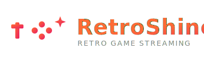

<p align="center">
  
</p>

<h1 align="center">RetroShine</h1>
<p align="center">
  <b>Retro game streaming server on Docker.</b><br>
  Stream NES, SNES, Game Boy, Game Boy Advance, and Sega Genesis games<br>
  from your server to any <a href="https://moonlight-stream.org">Moonlight</a> client.
</p>

---

## ✨ Features

- **5 consoles** — NES, SNES, GB, GBA, Genesis — each with a dedicated RetroArch core
- **Low-latency streaming** — VAAPI H.264 hardware encoding over Moonlight protocol
- **ES-DE frontend** — Beautiful game launcher with box art support
- **Single Docker container** — Everything baked in: Sunshine + ES-DE + RetroArch
- **Gamepad support** — Zero-config controller passthrough via Moonlight

---

## 🚀 Quick Start

### Prerequisites
- Docker with Compose V2 plugin
- A Moonlight-compatible client (Windows, Mac, Linux, Android, iOS, or Raspberry Pi)
- A GPU with VAAPI support (Intel QSV / AMD VAAPI) or software encoding fallback

### 1. Clone & Start
```bash
git clone https://github.com/aldervall/retroshine.git
cd retroshine
docker compose up -d
```

### 2. Add ROMs
Place your legally owned ROM files in the corresponding `roms/` subdirectory:

| Console | ROM Directory | File Extensions |
|---------|--------------|-----------------|
| NES | `roms/nes/` | `.nes` |
| SNES | `roms/snes/` | `.sfc` `.smc` |
| Game Boy | `roms/gb/` | `.gb` |
| Game Boy Advance | `roms/gba/` | `.gba` |
| Sega Genesis | `roms/genesis/` | `.gen` `.md` |

> ROMs are live-synced into the container — no restart needed.

### 3. Open Web UI
Navigate to **`https://<your-server-ip>:47990`**

Login: **admin** / **retro123**

### 4. Pair Moonlight
1. Open your Moonlight client → Add host → enter your server IP
2. A 4-digit PIN appears in Moonlight
3. Enter this PIN at the Web UI → it pairs instantly

### 5. Play!
Launch **"ES-DE (EmulationStation)"** for the full game launcher experience, or **"RetroArch (standalone)"** for direct core access.

**That's it. You're gaming.** 🎮

---

## 🏗 Architecture

```
Moonlight Client ──HTTPS──> RetroShine (Docker, host network, privileged)
                              │
                              ├── Xvfb :99 (virtual display)
                              ├── PulseAudio (audio server)
                              ├── VAAPI H.264 encoder (HW encoding)
                              ├── ES-DE (frontend + game launcher)
                              └── RetroArch (emulation)
```

| Component | Role |
|-----------|------|
| Sunshine | Game streaming server (Moonlight protocol) |
| ES-DE | Frontend game launcher with box art |
| RetroArch | Emulation via libretro cores |
| Xvfb | Virtual display (headless) |
| PulseAudio | Audio server (null sink) |

---

## 📡 Ports

| Port | Protocol | Purpose |
|------|----------|---------|
| 47984 | TCP | HTTPS pairing & control |
| 47989 | TCP | HTTP pairing |
| 47990 | TCP | HTTPS Web UI |
| 48010 | TCP | RTSP stream setup |
| 48100 | UDP | Video stream (RTP) |
| 48200 | UDP | Audio stream (RTP) |

---

## 🛠 Deployment

For Proxmox LXC deployment with automated RAM bump and smoke tests:

```bash
bash deploy.sh
```

Edit `deploy.sh` to set your PVE host IP, LXC host IP, and SSH credentials.

---

## 📝 License

MIT — see [LICENSE](LICENSE)

---

*RetroShine is not affiliated with Nintendo, Sega, or any game console manufacturer. ROMs are not included — you must provide your own legally obtained game files.*
